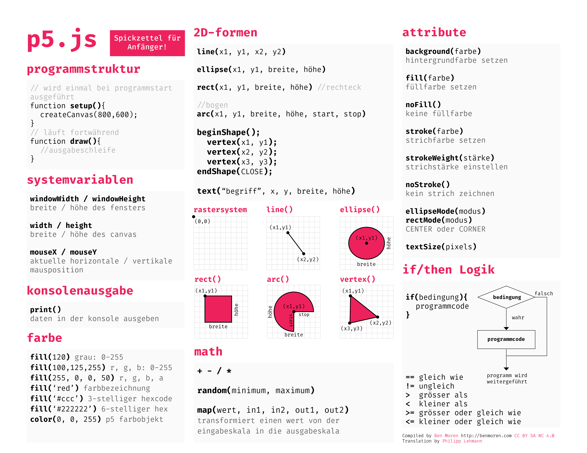

# a p5js cheat sheet for beginners!

I'm looking for help translating this cheat sheet into as many languages as possible, Spanish and Chinese are high priority! Please reach out in the issues tab or via the [p5.js forum post](https://discourse.processing.org/t/a-p5-js-cheat-sheet-for-beginners/8236/7) if you can help!

### English - Beginner Cheat Sheet
[Download PDF](p5cheatsheet.pdf)

### French - Beginner Cheat Sheet
[Download PDF](p5cheatsheet-FR.pdf)

Translation by: @rich-gg

### Japanese - Beginner Cheat sheet
[Download PDF](p5cheatsheet-JA.pdf)

Translation by: Takawo Shunsuke

### German - Beginner Cheat sheet
[Download PDF](p5cheatsheet-DE.pdf)

Translation by: Philipp Lehmann

---

[Creative Commons BY NC SA 4.0](https://creativecommons.org/licenses/by-nc-sa/4.0/)

With thanks to past cheat sheets like Ryo Sakai's more [comprehensive p5.js sheet](https://twitter.com/ryodejaneiro/status/827314983948210176) !
